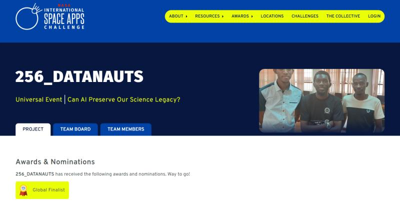
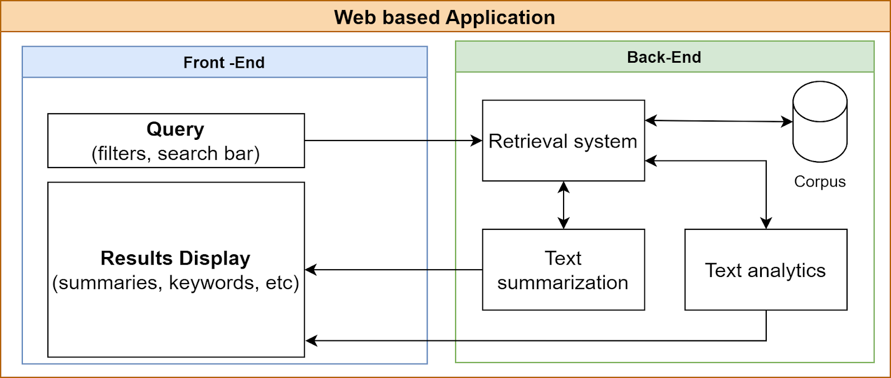

# NASA_SPACE_APPS_CHALLENGE 2022 

## 🌎 CHALLENGE: CAN AI preserve our Science Legacy
The NASA Technical Report Server (NTRS) includes hundreds of thousands of items containing scientific and technical information (STI) created or funded by NASA. Imagine how difficult it can be to locate desired information in such a large repository! Your challenge is to develop a technique using Artificial Intelligence (AI) to improve the accessibility and discoverability of records in the public NTRS.

## OUR SOLUTION: NASA NTRS DOCUMENT RETRIEVAL SYSTEM
Over 50% of the NASA Technical Reports Server (NTRS) documents are legacy documents that were obtained by scanning and using Optical Character Recognition (OCR). These documents are difficult to access and discover in the NTRS. We developed an AI-based web application that utilizes Natural Language Processing (NLP) to automatically read these documents, summarize them, generate text analytic data, and produce a list of topic keywords to help researchers find these documents within the NTRS. This improves the accessibility and discoverability of these documents for both scientific and historical researchers.

### ️💻 Technology stack

The project was developed using the following technologies:
- Python
- Streamlit
- Gensim
- PyPDF
- NLTK
- Numpy
- Pandas
- Pdfminer
- Spacy
- Flashtext

### Data
We used data from the [NASA Technical Report Server](https://ntrs.nasa.gov/search?center=CDMS) which provided records to thousands of documents and reports. We used these documents to create a corpus, which was used to develop the retrieval, text summarization and analytics systems.

We also used the NASA [NTRS OpenAPI](https://ntrs.nasa.gov/api/openapi/) to automatically download the 60 documents based on subject category.

### 🤝 Team
Solution made by **Galactic Space Coders 🛰️**:
- [👨‍🎨 Augustine Tuhimbise](https://www.linkedin.com/in/augustine2018/)
- [👷‍♂️ Alvin B. Kimbowa](https://github.com/alvinkimbowa)
- [👷‍♂️ Paul O. Mugume](https://github.com/PaulOkwija)

